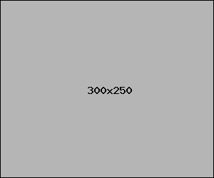

# বাঙাল ঘড়ি (CountdownBengalClock)
CountdownBengalClock show the date and time in Bengali font. Your simple and beautiful bangla clock for Android. It also show the Bengali day, months and seasons name, day and night length in hour/minute/second. You can also put the widget on your android home screen.

## Advertisement
> `ads size 331×42`


```
$ https://aladaapp.github.io/CountdownBengalClock/assets/advertisement/ads/ads.html
```
> `ads size 300×250`


```
$ https://aladaapp.github.io/CountdownBengalClock/assets/advertisement/ads/ads_300by250.html
```
